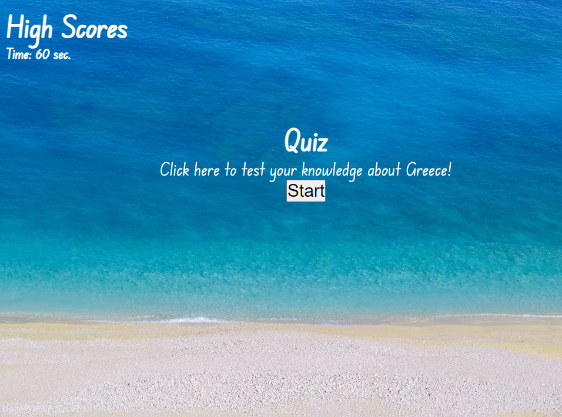
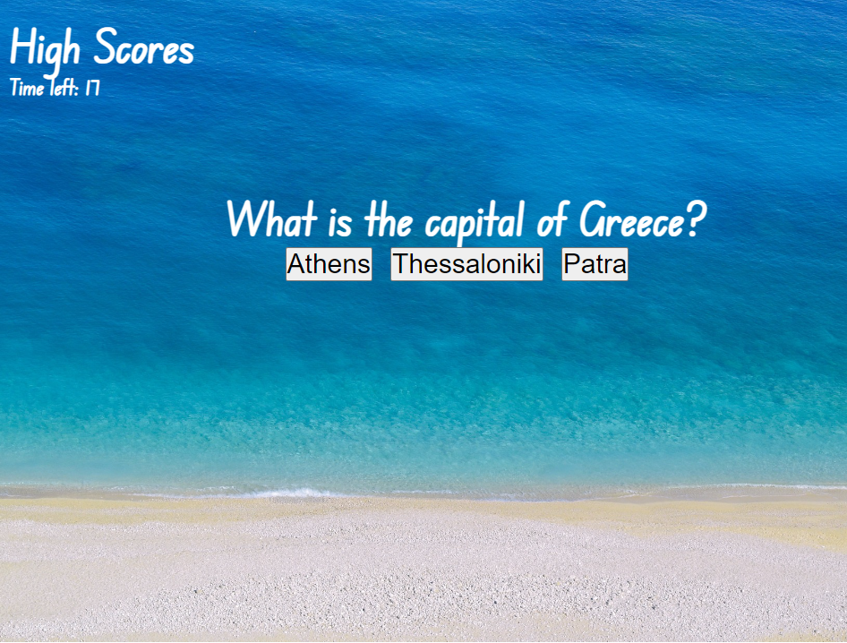
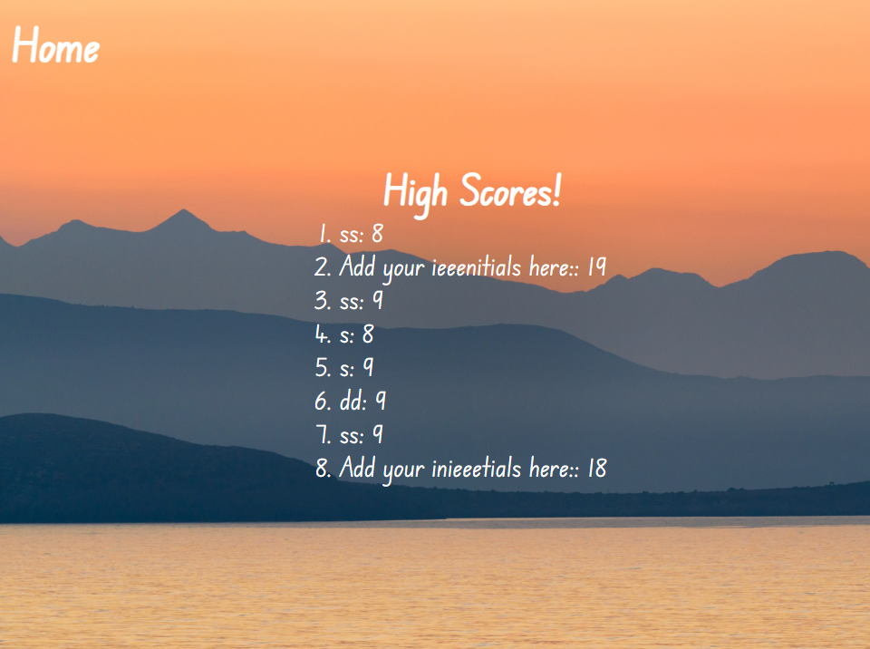

# QuizCode# 04 Web APIs: Code Quiz

This is a quiz about Greece. 

GitHub: https://efp18.github.io/QuizCode/

With the help of HTML, CSS and JavaScript, I created a webpage with a short quiz. 
To achieve this, I created a basic HTML file which worked dynamically with JavaScript to bring out information after clicking certain buttons. 

I created an array of objects for my questions, which appeared on the screen one by one, with possible answers underneath them. 
The quiz checks the truthfulness of the response and informs the user of correct or wrong. When the question is answered incorrectly, 10 seconds are subtracted from the time, which ends up being the score.

At the end of the quiz, the users are able to insert their initials and save their score. That was achieved with the use of local storage. 

